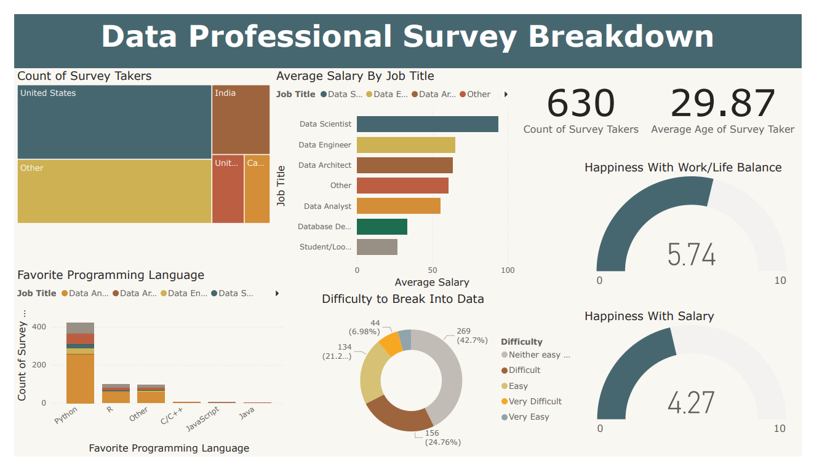

# Power BI Dashboard: Data Professionals Survey

This Power BI dashboard presents insights derived from a survey conducted among 630 data professionals. The survey captured data on various aspects such as favorite programming languages, country of origin, average age, and average salary. The dashboard provides visualizations that highlight key findings and trends within the dataset.

## Data Collection

The survey data was collected from 630 data professionals with diverse job titles, including data analysts, data scientists, data engineers, and more. The participants were asked to provide information on their preferred programming languages, country of residence, age, and salary.

## Data Transformation

To ensure accurate analysis and visualization, the survey data underwent several transformations using Power Query within Power BI. The following transformations were applied:

- Standardizing Values: The values in certain columns were standardized to ensure consistency and accuracy during analysis.

- Column Splitting: Delimiters were utilized to split certain columns into separate fields, enabling better categorization and analysis of the data.

- Column Removal: Unnecessary columns that did not contribute to the insights or visualizations were removed to enhance data clarity and reduce clutter.

- Data Type Changes: Appropriate data types were assigned to each column, ensuring accurate calculations and visualizations.

## Dashboard Features

The Power BI dashboard showcases the following visualizations based on the transformed survey data:

- Favorite Programming Languages: This visualization presents a breakdown of the preferred programming languages among the data professionals, offering insights into their programming language preferences.

- Country of Origin: This visualization displays the distribution of data professionals across different countries, highlighting the geographical diversity of the respondents.

- Average Age: This visualization illustrates the average age of data professionals participating in the survey, providing a demographic overview.

- Average Salary: This visualization showcases the average salary range among the survey respondents, giving insights into the earning potential within the data profession.

## Visualization
To view the Power BI dashboard, download the **DataProfessionalDashboard** Power BI file from this repository.

