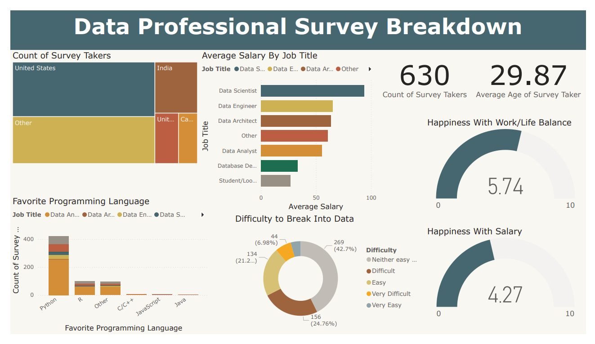

# Data Professionals Survey Dashboard

This project demonstrates the development of an interactive Power BI dashboard using survey data collected from more than 600 data professionals. The dashboard explores programming language preferences, salary trends, work-life satisfaction, career demographics, and geographic distribution through interactive visualizations.

## Technologies

- Power BI
- Power Query
- DAX
- Data Modeling

## Data Collection

The project uses a publicly available survey dataset containing responses from over 600 data professionals. The survey captures demographic information, programming language preferences, salaries, career satisfaction, and geographic location.

## Project Features

- Cleaned and standardized survey responses using Power Query.
- Split and transformed categorical fields to improve reporting.
- Assigned appropriate data types for accurate calculations.
- Prepared an analysis-ready dataset for dashboard development.

## Dashboard Features

- Built interactive KPI cards summarizing participant demographics and survey statistics.
- Visualized salary trends across data-related job titles.
- Compared programming language preferences among different professional roles.
- Explored work-life balance and salary satisfaction using interactive gauges.

## Visualization
To view the Power BI dashboard, download the **DataProfessionalDashboard** Power BI file from this repository.

